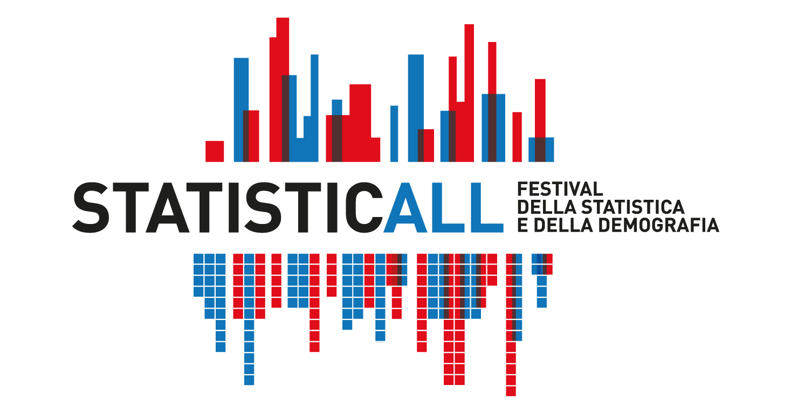
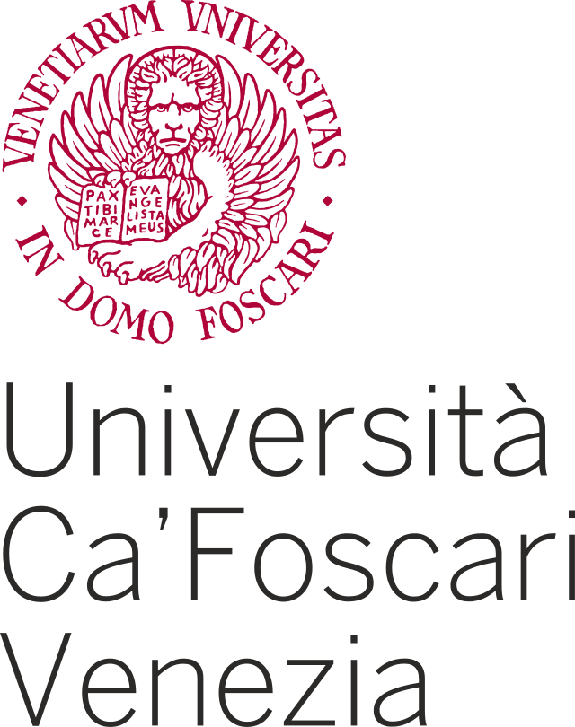

Incontro Scientifico degli Statistici Sociali {.poster-title}
================================================================================

 

**VENERDì 2 DICEMBRE** {.S2}
================================================================================

**Educazione (dropout)** (Moderatore: Giulio Ghellini) {.S3}
================================================================================
| Speaker  | Talk  | Orario  |
|---|---|---|
| Valentina Tocchioni | From high school to university: Assessing the effect of high school outcomes on students' academic performances | 15.00-15.15  | 
| Carla Galluccio  | Students enrolled in STEM disciplines in Italy: patterns of retention, dropout and switch]   | 15.15-15.30  |  
| Cristian Usala  | Assessing the role of peers in university students' dropout   | 15.30-15.45  | 
| Simone Gerzeli | Customized learning to predict university student dropout  | 15.45-16.00  |  
| **COFFEE BREAK** | | 16.00-16.30|

**Servizi** (Moderatore: Stefano Campostrini) {.S4}
================================================================================
| Speaker  | Talk  | Orario  |
|---|---|---|
| Angela Andreella  | Spatial clusters for demand and supply of childcare services in Italy  | 16.30-16.45  | 
| Pietro Belloni  | Identification of neighbourhood clusters on data balanced by a poset-based approach  | 16.45-17.00  |  
| Pietro Renzi  | Methodological issues in measuring health inequality  | 17.00-17.15  | 
| Agostino Stavolo | La Symmetric Non-Negative Matrix Factorization per l'analisi del dibattito scientifico sulla day surgery: un confronto tra la produzione scientifica internazionale e italiana   | 17.15-17.30  |  

**Miscellanea** (Moderatore: Mariano Porcu) {.S5}
================================================================================
| Speaker  | Talk  | Orario  |
|---|---|---|
| Annalisa Donno  | A shock is not enough. The persistence of gender inequality in unpaid work among Italian couples during the Great Recession | 17.30-17.45  | 
| Francesco Santelli  | The "words" of no green-pass communities on twitter. The Italian case.  | 17.45-18.00  |  
| Demetrio Panarello  | Job loss and financial struggle among the older age groups in 2021: Lessons from the European Union | 18.00-18.15  | 
| Ida Camminatiello | Proposte per risolvere i problemi di multicollinearità e valori anomali nei modelli logit | 18.15-18.30  |  

**SABATO 3 DICEMBRE** {.S6}
================================================================================

**Immigrazione e indicatori** (Moderatore: Giovanna Boccuzzo) {.S7}
================================================================================
| Speaker  | Talk  | Orario  |
|---|---|---|
| Giovanni Busetta  | Statistical and taste-based discrimination: an application of Discrimination Decomposition Index (DDI) using first- and second-generation immigrants  | 9.45-10.00  | 
| Simone Del Sarto  | Measuring the risk of corruption: modern data integration on Italian public procurement data as an instrumental step to develop a composite indicator for corruption risk  | 10.00-10.15  | 
| **COFFEE BREAK** | | 10.15-10.45|

**Educazione e famiglie** (Moderatore: Massimo Attanasio) {.S8}
================================================================================
  | Speaker  | Talk  | Orario  |
  |---|---|---|
  | Martina Vittorietti  | Does taking additional Maths classes in high school affect academic outcomes? | 10.45-11.00  | 
  | Antonino Di Pino Incognito  | Intergenerational transmission of education and the mediating effects of fertility behaviour  | 11.00-11.15  |  
  | Ilaria Primerano  | On the use of Social Network Analysis to study social phenomena | 11.15-11.30  | 
  | Marco Tosi  | Family complexity and intergenerational solidarity  | 11.30-11.45  | 
  

Informazioni {.S9}
================================================================================

L'evento avrà luogo presso l'aula magna nel palazzo San Leonardo dell'Università Ca' Foscari, Riviera Garibaldi, Treviso

**Contatti**:

  - Web: https://socialstat.github.io/
  
  - Email: angela.andreella@unive.it
